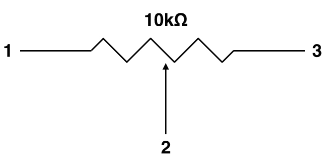

# Chapter 3: Measuring Voltage
**Objective:** Use Arduino measure a voltage and calculate a resistance.

## Introduction: Voltage and Ohm's Law

A ***voltage*** is a difference in *electrical potential energy* between two points in a circuit, typically measured in  *volts* (1V = 1 joule per coulomb).  Think of it as stored electrical energy that can be used to drive electrical current from one point to another.

To have a voltage, there must also be a ***resistance***.  Resistance can be thought of as an obstruction to the flow of electrical current, and is measured in *ohms* (represented by $\Omega$ (capital omega), $1\Omega=1$ V per ampere).  For example, think of a very wide water pipe with no restrictions.  No matter how much the pipe is pressurized, it's impossbile to create a pressure differential between the two ends.  But if we introduce a narrow section and pressurize one end, we create high pressure on one side of the restriction and low pressure on the other.  Water then flows from high pressure to low pressure. In this analogy, the restriction is analogous to resistance, the pressure to voltage, and the flow to current.  In electricity, these things are related by *Ohm's Law*:

$$
V= IR
$$

where *V* is the voltage, *I* is the current, and *R* is the resistance.

Many sensors work on the principal of changing either the voltage or the resistance in relation to a physical phenomenon.  For example, the ozone sensors we'll use later in the semester have a heating element with a resistance that changes in response to ozone.  Because of Ohm's Law, we don't have to measure the resistance directly if we can measure the voltage (it's usually easier to measure a voltage).  In this exercise, you'll learn how to measure the voltage across a resistor with an Arduino.

## Measuring a Voltage

To measure a voltage with Arduino, you'll also need understand how to receive data from the Arduino.  This is done over a serial port (which is connected via the USB cable).  The `setup()` section of the program must contain the proper code to set the serial port *baud rate*, which is how fast the Arduino sends data to the computer.  The standard value is 9600 Bd. 

You'll also need to knowknow a little bit about the A/D conversion.  Don't worry if it seems complicated at first, we'll walk through it step-by-step in the exercise!  The Arduino doesn't output a voltage value directly, but rather gives the value in **bits**.  A bit is a single binary value (on or off) that is the output of the Arduino's *analog-to-digital* converter. (Analog values are continous, while digital values are binary.)  In this case, the Arduino has a 10-bit A/D converter, with 2 values (on/off) per bit, yielding 1,023 possible values:

$$
2^{10} = 1024
$$

These are analogous to "bins" for the voltage values.  Whatever voltage the Arduino measures gets placed in the bin closest to it's true value.  The output the Arduino sends to the computers then has units of bits (not voltage), but the bit values can easily be converted to voltage.  The lowest bit (0) corresponds to the lowest possible voltage (in this case, 0V), and the highest bit (1023) corresponds to the highest possible voltage (here, 5V).  Thus, to turn the Arduino output into a meaningful voltage measurement, we can use the following formula:

$$
V = \text{Sensor Bit Value} * \frac{V_{max}}{\text{Max Bit Value}}
$$

We'll program this in the exercise, but first we need to connection the potentiometer.

### Connecting the Sensor
The sensor we'll use today is called a ***potentiometer***, and is simply a variable resistor.  The resistance of these particular potentiometers ("pots") can be adjusted from ~0--10k$\Omega$ (about 0 to 10,000 ohms).  The resistance value is changed by turning the screw on the front of the potentiometer.  Looking at the pinout of a potentiometer in Figure 1 (or sometimes even printed on the pot itself!), you'll see there are 3 pins.  The two outer pins are fixed, while the middle pin (the *wiper*) moves to adjust the resistance.  We'll use one outer pin and the wiper today.

<center>  </center>

<small> **Figure 1:** Schematic symbol for a potentiometer.  The zig-zag line represents a resistor, and the arrow across it indicates it is variable (i.e. a potentiometer). </small>

Knowing the resistance of the pot can tell us how far the screw has been turned, and will allow us to make a rotation sensor.  However, potentiometers are often used as controls rather than sensors.  For example, volume knobs on stereos, speed controls on windshield wipers, and dimmer switches on lights are all examples of potentiometers being used to control the output of a circuit.  

**To connect the potentiometer:**

1.  Wire either of the outer pins to 5V on the Arduino.
1.  Wire the wiper (middle pin) to an analog input (e.g. A0).

Your setup should look similar to Figure 2.

<center> </center>

<small> **Figure 2:** Pictoral representation of the potentiometer and Arduino (left) and schematic of the same (right). </small>

### Programming the Arduino

Your sketch will need the same basic parts as you had in the last exercise: variable definitions, a `setup()` command, and a `loop()` command.  The analog pins (A0--A5) allow for voltages to be measured, but remember the Arduino outputs bits and not voltage.

1.  Create a comment block that contains your name, the date, and the purpose of the code.  From now on, always include a section like this in your code.

    ```
    \*
      Name:
      Date:
      ...
    *\
    ```
  
1.  Next, define the appropriate variables.  You'll need to differentiate between integers (`int`) and floating point (decimal, `float`) numbers.  For the initial setup, we just have to tell the Arduino what the names are and can assign any arbitrary value (e.g. 0).

    ```
    int sensorValue = 0;
    float voltage = 0;
    ```

      > *Remember the raw sensor value is in bits and is an integer.  However, when it's converted to a voltage, it will become a decimal number, so the voltage must be in floating point representation.*
      
1.  Write the `setup()` routine.  Remember to set the baud rate to 9600 Bd.
    
    ```
    void setup() {
      Serial.begin(9600);
    }
    ```
    
1.  Write the repeating loop.
    
    ```
    void loop() {
    
        // 1. read the value on pin A0 & assign to "sensorValue"
      sensorValue = analogRead(A0);
      
        // 2. convert sensorValue to a voltage & assign to "voltage"
      voltage = sensorValue * (5.0 / 1023.0);
      
        // 3. print the results to the serial port
      Serial.print(sensorValue); 
      Serial.print(", ");
      Serial.println(voltage);
      
        // 4. wait a second before repeating
      delay(1000);
      
    }
    ```
    
    > *When working with floating point numbers, make sure you include anything after the decimal point (even if it's just ".0") or you'll get rounding errors in your results.*
    
1.  Check your program and upload it to the board in the same way you did for the last exercise.

1.  To see the output, click on the Serial Monitor icon (magnifying glass) in the top right corner of the IDE.

1.  You should see two columns of data, the raw bit value and the voltage value.  Try turning the screw on the potentiometer.  What happens to the voltage?

1.  Add a line of code to convert the voltage to resistance using Ohm's law.  Print the output to the serial port as you did with the voltage value.

1.  If you have time, try combining this with your sketch from the last exercise to turn the LED on when the voltage reaches a predefined value.  Ask about using an `if()` statement to do this.  Alternatively, try using the same code from the LED exercise but this time use the potentiometer as a dimmer.


## Additional Resources
1. [Arduino ReadAnalogVoltage](http://arduino.cc/en/Tutorial/ReadAnalogVoltage)
