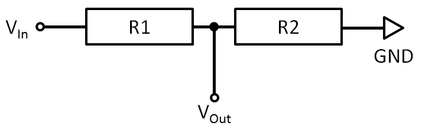
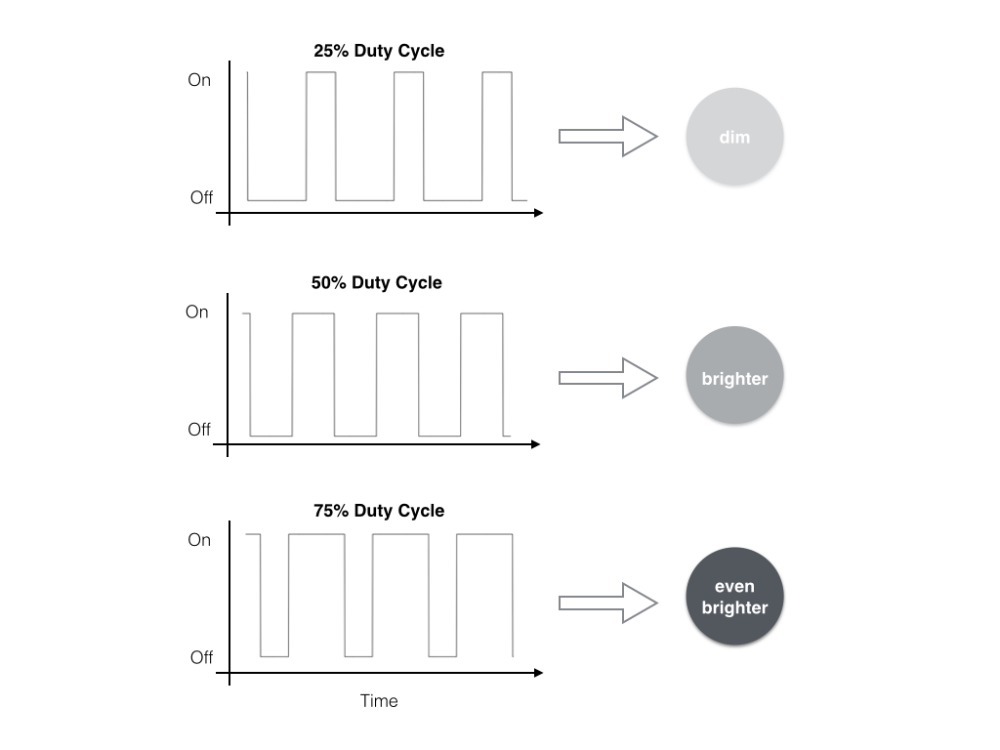
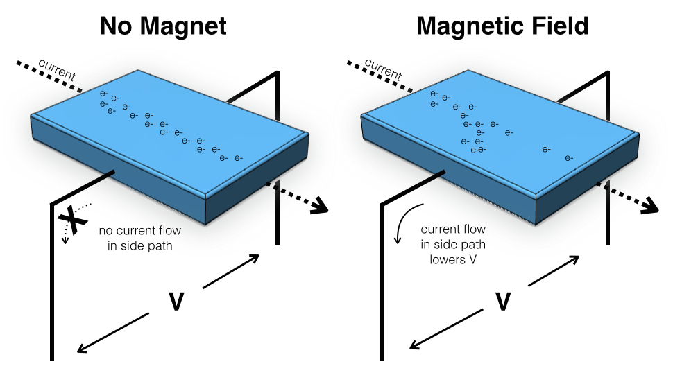
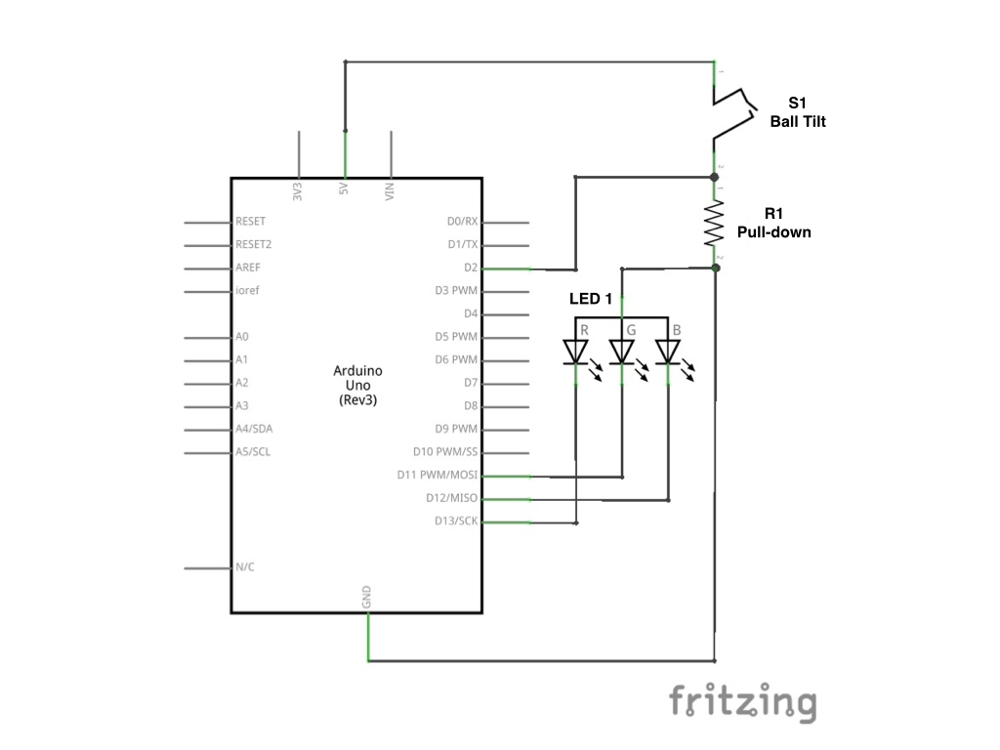
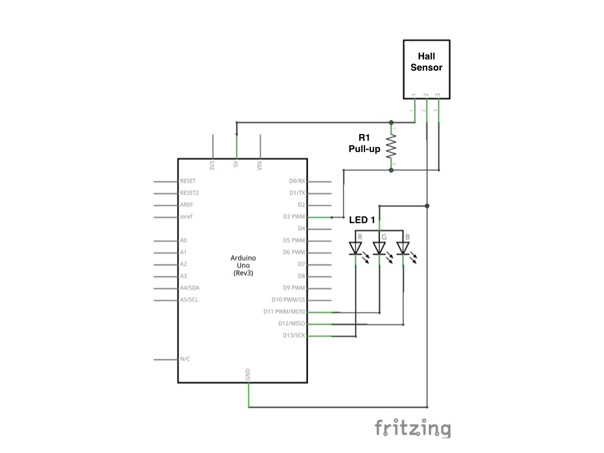
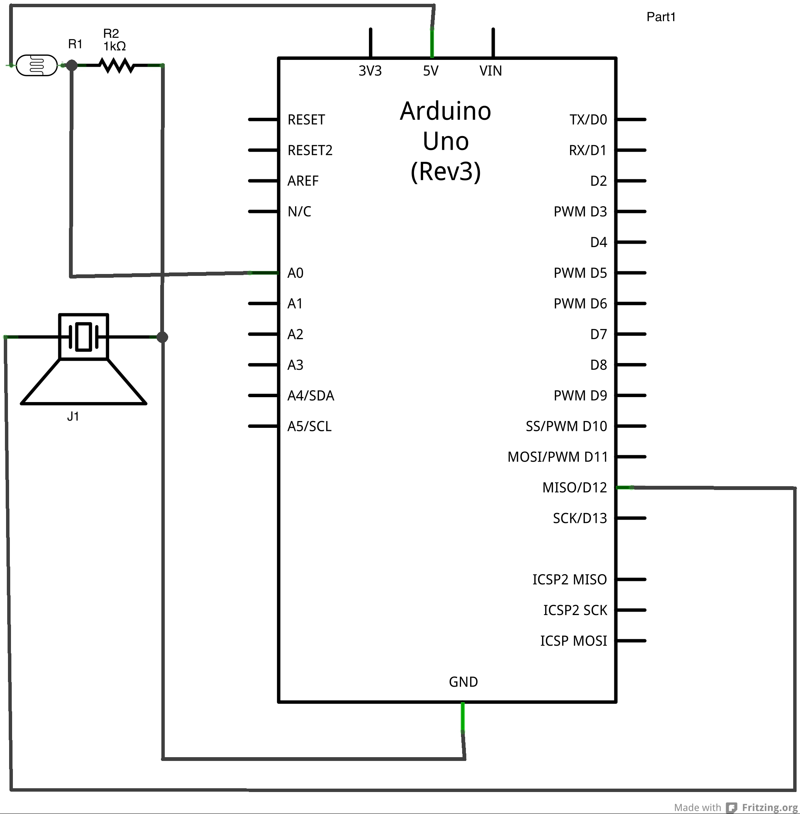

# Chapter 4: Electronics Primer and Signal Transduction
**Objective:** Use Arduino as an interface between electronics and the tangible world while becoming familiar with key electronics concepts.

## Introduction

Within the field of scientific instrumentation, a *transducer* is a device that converts a signal from one form to another.  For example, a microphone takes a sound signal (actually just a pressure wave) and converts it to an electrical signal.  After conversion to an electrical signal, the sound can be amplified (made louder), stored (for example as an mp3 file), or transported over long distances (as with a telephone).  Transduction can also work in the opposite direction.  A speaker takes an electrical signal and converts it to a pressure (sound) wave that humans can hear.  In either case, a signal has changed from a "physical" signal (sound, light, mass, etc.) to an electrical signal that is easier to store, transport, and manipulate.

In some chemistry experiments (e.g. reference 1), it might be necessary to shine a several lasers through a sample, turning them on and off thousands of times per second while recording their intensity and using changes in the intensities to drive a motor and move optical components.  This requires several coordinated transduction steps to generate the signal, detect it, and provide feedback.  Increasingly, microcontrollers are used to coordinate data acquisition and instrument control (for example, see Figure 1 below).  The Arduino is able to handle both *analog* input (pins A0--A5) and *digital* input-output (pins 0--13).  In the last exercise, you used the analog inputs, which measure a continously variable voltage (i.e. signals with an infinite number of possible values/no logical divisions).  In contrast, digital inputs measure signals that are *binary*, with only two possible values of 0 or 1 (also called off and on, or low and high).  Both types of signals are useful in various circumstances, and both will be used in this exercise.

<center>    </center>
<small> **Figure 1:** An Atmel SAM7X series microcontroller at the heart of the Agilent Technologies Cary 60 Spectrophotometer.  </small>

The goal of this exercise is to help you become familiar with using the Arduino as an interface between the everyday world and electrical world.  It exercise in broken up into several sub-exercises, all of which are centered around signal transduction.  They each realy on various key electrical concepts, and many of them could be used in conjunction (so once you've completed your exercise, you could find a classmate to team up with and build a device we haven't listed here!).  Although you only need to complete a minimum of 1 sub-exercise, you should be familiar with all the concepts described below because they'll come up again later in the semester!

### The Voltage Divider for Analog Signals

The *voltage divider* is a core component of many electrical circuits, and is simply two resistors arranged such that the circuit output is a fraction of the input.  Among other uses, it provides a way to measure the voltage across a resistive sensor.  A generic voltage divider is shown in Figure 3A-1.

<center>    </center>
<small> **Figure 3A-1:** A generic voltage divider.  $R_1$ and $R_2$ are resistances, $V_{in}$ is an applied voltage, GND is ground, and $V_{out}$ is the output voltage (less than $V_{in}$.) </small>

In this setup, $V_{out}$ is described by the following equation:

  $$
  V_{out} = V_{in} \frac{R_2}{(R_1 + R_2)}
  $$

When you start setting up the sensor, you'll want use the sensor as $R_1$, and you'll need to find a good value for $R_2$ using the voltage divider equation above.

### Pull-up and Pull-down Resistors for Digital Signals

Several sub-exercises will require the use of digital inputs.  In contrast to analog inputs (which are continously variable), digital inputs can have only one of two discrete values: on or off.  Digital inputs typically require *pull-up* or *pull-down* resistors to function reliably.  These resistors keep the input at the "high" or "low" voltage, respectively. Without them, it is possible that the input would develop it's own potential and "float" to whatever voltage it pleases, causing erroneous readings.  To implement a pull-down resistor, simply connect the input pin to ground through a ~10k$\Omega$ resistor.  When no signal is present on the pin, the input will be kept at a potential of 0V due to the connection to ground; however, when a sufficiently high signal is present, the current will take the path of least resistance, bypassing the pull-down resistor, and causing the input to be held at 5V.  A pull-up resistor uses the same idea, but the input is connected to $V_{cc}$ (i.e. 5V) rather than ground.  Figure 3B-1 shows the typical implementation of a pull-down resistor.

### PWM for Controlling Output Intensity

For several of the Chapter 4 sub-exercises, you'll need to control the brightness of an LED.  *Pulse width modulation* (PWM) is often used to control things like the brightness of lights or the speed of motors.  As Figure 3A-2 shows, PWM relies on using a square waveform to power a device while altering the *duty cycle* to control the brightness or speed.  The term duty cycle refers to the amount of time the LED is on.  Thus, when powering an LED with PWM, it isn't actually on continuously, but rather flashes on and off faster than you can see.  For example, a duty cycle of 50% means the LED is on 50% of the time and off the other 50%.  If the duty cycle is changed so that the LED is on for 75% of the time, our eyes register it as an increase in brightness; if the duty cycle is lowered to 25%, we see dimmer light.  The Arduino has 255 settings for PWM (0--255), with 255 being always on and 0 being always off.  By converting the sensor output to a value that ranges from 0 to 255, it is possible to use input from the environment to control the LED brightness output by the Arduino.

<center> </center>
   <small> **Figure 3B-1:** Concept diagram of a pull-down resistor. $V_{cc}$ = 5V and GND = ground. </small>

<center>    </center>
    <small> **Figure 3A-2:** Pulse width modulation.  By changing the amount of time a device is on, PWM can make lights appear to brighten or dim, or make motors go faster or slower. </small>

### `if()` Statements for Selective Code
Sometimes it is necessary to run code only if a certain condition is true.  For example, you may want to tourn on a warning light when the temperature of your device raises to an unsafe level.  An `if()` statement provides a simple way to do this.  These statements are sections of code that run only if the argument in them evaluates to `TRUE`.  In programming, `TRUE` typically means the same thing as `HIGH` and is assigned a value of 1.  For example, the following code would turn digital pin 13 on when pin 2 goes high.

```
pinState = digitalRead(2);

if (pinState == TRUE) {
    digitalWrite(13, HIGH);
}
else {
    digitalWrite(13, LOW);
}
```

The `else` portion of the code tells the Arduino what to do when the pinState is low.  In this case, it keeps pin 13 low.

## Additional Resources
1. Long, D.A. *et al.* (2012). Frequency-stabilized cavity ring-down spectroscopy. *Chemical Physics Letters*, 536, 1-8.
1. [Sparkfun Voltage Divider Tutorial](https://learn.sparkfun.com/tutorials/voltage-dividers)
1. [Sparkfun PWM Tutorial](https://learn.sparkfun.com/tutorials/pulse-width-modulation)
1. [Sparkfun PU Resistor Tutorial](https://learn.sparkfun.com/tutorials/pull-up-resistors)
1. [Sparkfun Digital Logic Tutorial](https://learn.sparkfun.com/tutorials/logic-levels)
1. [Arduino Language Reference: if()](http://arduino.cc/en/Reference/if)

## Chapter 4A: The Voltage Divider
**Objective:** Build a voltage divider to sense a variable resistance using the Arduino's analog input, and use the signal to control the brightness of an LED.

### Background
The goal of this exercise is to measure a resistance that changes in response to some input, either light or touch, and to have the sensor output control an LED.  The sensors are analog, and to get data from them you'll need to measure an analog voltage like you did in Exercise 2.  The LED will be controlled with a digital pin, just as it was in Exercise 1.  However, this time you'll need to use *pulse width modulation* (PWM) to control the brightness of the LED.

### Using Sensors with Arduino

You will need to use *one* of the following, provided for you:

1. **Force sensitive resistor:** A force sensitive resistor (FSR) is made from a sheet of materials whose resistance changes with the amount of force applied.  They are similar to a switch, but they have an infinite number of values rather than just on or off.  This allows you to use them, for example, as a dimmer.  A diagram of an FSR is shown in Figure 3A-3.

    <center> </center>
   <small> **Figure 3A-3:** Diagram of a force sensitve resistor.  Reprinted from [learn.adafruit.com](https://learn.adafruit.com/force-sensitive-resistor-fsr). </small>

1. **Light sensitive resistor:** Perhaps the simplest light detector is a CdS (cadmium-sulfide) *photocell*.  A photocell sensor is a variable resistor made of a light-sensitive material (cadmium sulfide).  As more light hits the photocell, it's resistance changes.  Figure 3A-4 shows a typical CdS photocell.

   <center>    </center>
    <small> **Figure #A-4:** Typical construction of a CdS photocell.  Reprinted from [learn.adafruit.com](https://learn.adafruit.com/photocells/overview). </small>

**Connecting the Sensor**

1. Use the voltage divider equation from the Electronics Primer section to find a good value for $R_2$, keeping in mind that the Arduino can measure from 0--5V.
    - For the FSR, the resistance will range from 250$\Omega$ to infinity
    - A typical CdS ($R_1$) resistance value is ~5 k$\Omega$
1. Let us know when you've come up with a value, and we'll help you find a resistor to use.
1. Construct the voltage divider as descibed above, and connect it to the appropriate pins on the Arduino (5V, GND, and an analog input).

**Programming the Arduino**
1.  Write a program to measure the voltage from the analog input you chose.  This will be *very* similar to the sketch you used in the potentiometer exercise (Exercise 2).
1.  Add code to light an LED.  Again, this will be similar to your previous code from the LED exercise (Exercise 1).  This time, just remember to use a PWM-compatible pin (those that are marked with a tilde, "~")!

    > *You'll need to decide which lines of code should go first.  Keep in mind that the program is read in a top-to-bottom fashion: Lines that are programmed first get executed first!*
    
1.  Add code to link the sensor output to the LED brightness:
    1. In the initial part of your sketch, define a variable for the brightness (should it be a `float` or an `int`?) and set it equal to 0.
    1. In the `loop()` portion of your program convert `voltage` to a brightness value ranging from 0--255.
    
        ```
        brightness = (1 - voltage) * 255 // PWM ranges from 0-255
        ```
    
    1. Add `brightness` as an argument in the call for `analogWrite()` in the portion where you write turn the LED on.  If you're unsure how to do this, look up the function in the Arduino code library online to find out what the argument "value" does.  Also make sure the LED is programmed to be on continuously, rather than flash as it did in Exercise 1.
1.  If you haven't already done so, include a line of code to print the voltage reading to the serial port (`Serial.print()` or `Serial.println()`).
1.  Upload your program to the Arduino. What happens to the voltage reading as you interact with the sensor?  What happens to the LED?  Does the behavior make sense logically?

### Additional Resources
1. [Adafruit Photocell Tutorial](https://learn.adafruit.com/photocells/overview)
1. [Adafruit FSR Tutorial](https://learn.adafruit.com/force-sensitive-resistor-fsr)

## Chapter 4B: Working with Digital Signals
**Objective:** Use Arduino's digital I/O pins and begin to understand digital signals.

### Background
In this exercise, you'll learn how to interface digital signals with the Arduino.  In contrast to analog signals, which are continously variable, digital signals only have two discrete values: on and off.  A common example of a binary device is a standard light switch that can be turned either on or off.  For comparison, a light switch with a dimmer has an infinite number of possible brightness values, and is not binary.  The Arduino has 13 digital I/O (combined input/ouput) pins labelled 1--13, and you'll need to use them to read a binary signal from a sensor and output a signal to control an LED.

### Using Arduino's Digital I/O Pins

You will need to use *one* of the following, provided for you:

1.  **Ball tilt sensor:** A ball tilt sensor is a type of switch consisting of two wires inside a chamber that houses a small metal ball.  When the sensor is upright, the ball contacts both wires, allowing electricity to be conducted between them; when the sensor is upside down, the ball moves and the circuit is broken, thereby switching anything connected to it off.  For example, space heaters often use tilt sensors to turn the heater off when it tips over, and analog thermostats in houses used tilt sensors with a "ball" of liquid mercury to turn a house's heating and cooling system on and off.  Figure 3B-2 shows the principal behind a ball tilt sensor.

<center>  </center>
   <small> **Figure 3B-2:** Two types of tilt sensors.  A ball tilt sensor like the one in this exercise (left) and a mercury tilt sensor from a thermostat (right). Reprinted from [learn.adafruit.com](https://learn.adafruit.com/). </small>

1.  **Hall effect sensor:** A hall effect sensor detects a magnetic field.  When charged particles moving in a straight line, like electrons moving through a wire, encounter a magnetic field, they are deflected.  As shown in Figure 3B-3, if another wire is placed perpendicularly to the first, a voltage is induced across the second wire when a magnetic field is present.  Hall effect sensors are often used as switches.  For example, many cars use a floating magnet and a hall effect sensor to detect when the level of gasoline in the tank is low.

<center> </center>
   <small> **Figure 3B-3:** Diagram of the Hall effect employed by Hall sensors to detect magnetic fields. </small>
   
1. Infrared photodiode and IR LED

**Connecting the Sensor**
Your goal is to turn an LED on using either the tilt sensor or the Hall effect sensor.  You'll need to connect an LED like you did in Exercise 1 and also connect the sensor output to another digital input.

1.  Connect the LED as you did in Exercise 1.
1.  Connect the sensors with the proper resistors.

    a. For the ball tilt sensor, use a *pull-down* resistor:
        1.  Connect one side of the sensor to a resistor and a digital input.
        1.  Connect the other side of the resistor to ground.
        1.  Connect the other side of the tilt sensor to 5V.
<center> </center>
            
    b. For the Hall sensor, use a *pull-up* resistor:
        1.  Connect pin 1 (check the [datasheet](http://www.adafruit.com/datasheets/US5881_rev007.pdf) for a pinout) to 5V.
        2.  Connect pin 2 to ground.
        3.  Connect pin 3 to to a pull-up resistor and a digital input.
        4.  Connect the other side of the pull-up resistor to 5V.
<center> </center>
    c. For the IR Photodiode, use a 
        1. Find the datasheet online (try searching "TMP36 Datasheet") and determine the pinout of the sensor.  Make sure your orientation matches that on the datasheet!
          

**Programming the Arduino**
1.  Open the LED sketch you wrote for Exercise 1 and remove the portions that make the LED blink.  Make sure you leave the portion that turns the LED on!
1.  In the `setup()` section of your code, add a line to configure the digital pin you connected the sensor to for `INPUT`.
1.  In the `loop()` section, add code to read the sensor value and turn the LED on or off based on the reading.  Remember that code is executed sequentially from top to bottom when choosing where to add the new code.
    1. Store the sensor reading to a variable, for example, one named `sensorValue`.  Should this be an `int` or `float`?
    1. Print `sensorValue` to the serial port using `Serial.println();`.
    1. Write an `if()` statement that evaluates whether the sensor is registering a signal, and then control the LED accordingly.  Check back at the example `if()` statement above if you're not sure how to do this.

### Additional Resources
1.  [Adafruit Ball Tilt Example](https://learn.adafruit.com/tilt-sensor/overview)

## Chapter 4C: Diodes
**Objective:** Use diode-based sensors to acquire a signal, and use that signal to control an LED.

### Background
The diode is one of the basic building blocks of electronics.  It is essentially a one-way street for electric current. It has very low resistance in one direction and effectively infinite resistance in the other.  Diodes are typically made of semiconductors (e.g. silicon with various elements added in for conductivity), and consist of a *p-n junction* (positive-negative junction) where electrons move from negative to positive, but not positive to negative (see Figure 3C-1).  Originally, diodes were used as one-way "check valves," but have evolved many other functions.  For example, LEDs, or *light-emitting diodes*, are doides that have had specific elements added in to emit various colors of light, and LEDs emmiting nearly any color of UV, visible, and IR light are now cheaply available.  Similarly, other diodes have been designed to detect specific colors of light; these are called *photodiodes*.  In a fashion similar to LEDs, photodiodes can be made to detect many different wavelengths of light based on which elements they are doped with.  Though these are some common examples of diodes, there are many, many more uses for them.  In this exercise, you'll explore just a few by using a diode based sensor.  As with the most of the activities in Chapter 4, you'll have to use the readings from the sensor to control an LED.

<center>    </center>
<small> **Figure 3C-1:** Common cicuit symbols for diodes (left) and schematic of the *p-n* junction in an LED. </small>

**Using Diode Sensors with Arduino**

You will need to use *one* of the following, provided for you:

1. TMP36 temperature sensor

1. UV photodiode

1. Visible photodiode

**Connecting the Sensor**

1.  Connect the sensor:
     a. For the TMP36:
        1. Find the datasheet online (try searching "TMP36 Datasheet") and determine the pinout of the sensor.  Make sure your orientation matches that on the datasheet!
        1. Connect $+V_S$ to  5V, $V_{out}$ to an analog input, and GND to ground.
     a.  For the UV and Visible photodiodes:
        1.  The pinout is labelled on the sensor.  Determine how to attach each to the Arduino.  Let us know if you are unsure what to do.

2.  Connect the LED as you did in Exercise 1.

**Programming the Arduino**

1.  Write a program to measure the voltage from the analog input you chose.  This will be *very* similar to the sketch you used in the potentiometer exercise (Exercise 2).
1.  Add code to light an LED.  Again, this will be similar to your previous code from the LED exercise (Exercise 1).  This time, just remember to use a PWM-compatible pin (those that are marked with a tilde, "~")!

    > *You'll need to decide which lines of code should go first.  Keep in mind that the program is read in a top-to-bottom fashion: Lines that are programmed first get executed first!*
    
1.  Add code to link the sensor output to the LED brightness:
    1. In the initial part of your sketch, define a variable for the brightness (should it be a `float` or an `int`?) and set it equal to 0.
    1. In the `loop()` portion of your program convert `voltage` to a brightness value ranging from 0--255.
    
        ```
        brightness = (1 - voltage) * 255 // PWM ranges from 0-255
        ```
    
    1. Add `brightness` as an argument in the call for `analogWrite()` in the portion where you write turn the LED on.  If you're unsure how to do this, look up the function in the Arduino code library online to find out what the argument "value" does.  Also make sure the LED is programmed to be on continuously, rather than flash as it did in Exercise 1.
1.  If you haven't already done so, include a line of code to print the voltage reading to the serial port (`Serial.print()` or `Serial.println()`).
1.  Upload your program to the Arduino. What happens to the voltage reading as you interact with the sensor?  What happens to the LED?  Does the behavior make sense logically?

### Additional Resources
1. [Adafruit TMP36 Tutorial](http://www.adafruit.com/products/165)

## Chapter 4D: Sound Output

**Objective:** Use Arduino to output play sounds that change based on an analog input.

### Background: What is Sound?
Sounds that we hear are actually pressure waves.  The areas of high and low pressure cause our eardrums to move back and forth, and these movements are then interpreted as a sound by our brain. (This is an example of biological signal transduction! The signal is converted from a pressure wave to an electrical signal that is processed by the neurons in our brains.)  Most humans can hear sounds ranging in frequency from 15--15,000 Hertz (1 Hz = 1 cycle per second), and the difference between high and low pitched sounds is the difference in frequency.

Speakers are devices used to take an electrical signal and convert it to a pressure wave.  Typical speakers have a thin diaphragm that moves back and forth to produce a sound.  The diaphragm is attached to a magnet whose position is controlled by an electromagnetic coil.  As current of varying frequencies move through the coil, the diaphragm responds accordingly.  

There are other ways to make sounds, especially when sound quality is not important.  For example, many buzzers are *piezoelectric* devices.  The word piezoelectric is a combination of the Greek word *piezein* (Greek, "to press") and electric, and piezoelectric devices convert pressure into electricity and *vice-versa*}*.  Many "trigger-type" gas lighters have a piezoelectric crystal that emits a spark with the ignite button is pressed, but it is also possible to make pressure waves by applying electricity to a piezoelectric material to make a sound (Figure \ref{piezo}).  In this exercise, you'll use one or the other of these sound generation methods to generate a tone in response to the intensity of light to create a pseudo-[theremin](http://en.wikipedia.org/wiki/Theremin).

```{r piezo, fig.cap = 'Representation of converting digital output to a sound wave.  Reprinted from learn.adafruit.com.', fig.align='center', echo=FALSE, fig.width = 5}
knitr::include_graphics("https://cdn-learn.adafruit.com/assets/assets/000/002/301/original/learn_arduino_sound.png?1396781508")
```

###Making Sounds

You will need to use *one* of the following, provided for you:

 - Speaker
 - Piezo buzzer

**Connecting the Speakers**

 - Build a voltage divider that contains the CdS photocell as $R_1$ and connect the output to one of the Arduino's analog inputs.  See Chapter 4A if you need further instructions.
 - Connect one side of the speaker/piezo to a digital output and the other side to ground (the orientation doesn't matter).
 - Check that your final setup matches the schematic in the speaker schematic above.

```{r speaker, fig.cap = 'Schematic of the Ardu-theremin.', fig.align='center', echo=FALSE, fig.width = 5}

```

**Programming the Arduino**

1. Write the comment block and define an integer named `pitch` with a value of 0.
2.  Write the `setup()` portion of the sketch.  You should include a `Serial.begin()` command in the `setup()` routine.
3.  Write the `loop()` portion of the program:
      * Read the voltage on the analog pin to which you connected the voltage divider output using `analogRead`.  Look back at your code from Exercise 2 if you don't remember how to do this.
	    * Convert the value to a meaningful pitch and store it in `pitch`.

  ```pitch = 200 + sensorValue / 4;```
  
4. Use the `tone()` command to control the digital output the speaker is attached to.  You may need to look up `tone()` in the online Arduino code library.
5. Upload your code and test the device.  What happens when you put your hand near the photocell?
6. If you have time, try making other sounds with the Arduino that aren't controlled by an input.  You can look up the notes for songs or sounds online 

### Additional Resources 

1. [The Adafruit sound tutorial provided much of this exercise.](https://learn.adafruit.com/adafruit-arduino-lesson-10-making-sounds/overview)